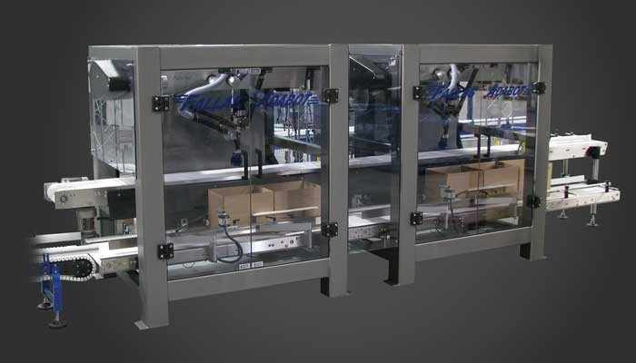

As a Controls Engineer at [Fallas Automation](https://www.fallasautomation.com/machinery.html) Joseph designed, assembled and debugged large multi-million dollar packaging machinery.

Fallas Automation a robotics case packaging company based out of Waco, Texas just released a new case packaging robot that could handle a wider variety of packages. Mr. Barkate was responsible for drafting electrical panels of robotics control systems using CAD drafting software and embedded system design knowledge.  

Once the packaging robots were constructed Mr. Barkate would begin the debugging process using PLC gate logic, HMI, and a servo control language.  Each Packaging robots required different software development strategies for different size products and packaging rates. 

Mr. Barkate oversaw communicating with assembly technicians to debug the multitude of control systems, to ensure the packaging robot met design specifications in the allotted time.  Joseph was also tasked with remote debugging and communication with costumers in event of bugs once assembled at the client site.

A video of a case packaging robot in action is available [here](https://www.youtube.com/watch?v=K87JwLIRGdM)

## Accomplishments and Responsbilities
* Worked with designers to understand schematics and wiring for high voltage robotic machinery. 
* Communicated client needs and robots specifications with installation technicians.
* Utilized spline interpulation logic in the programming of servomotors to allow case packaging robots to move in a parabolic fashion to pick up packages.
* Supported initial setup and offered client troubleshooting when packaging robots where installed in client warehouses.

## Project Technologies / Products
* CAD
* C++
* HMI
* TCP / IP
