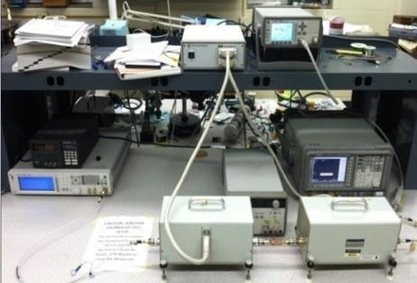
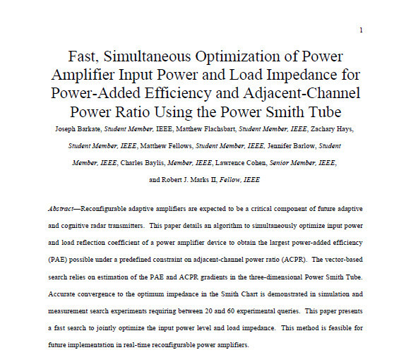
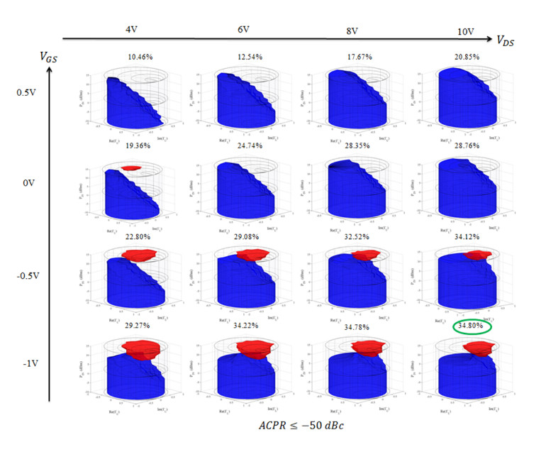

Baylor’s Wireless and Microwave Communication Systems (WMCS) lab wanted a way to view three power amplifier design characteristics at the same time. Mr. Barkate created a software tool to autonomously data mine circuit simulations in order to create this new three-dimensional realization of the Smith Chart.

 With the use of the new graphing tool, the WMCS team was able to write and present multiple unique plots of difference power amplifier characteristics. Mr. Barkate then created a software communication tool to communicate between Advance Design Systems’ netlist files and MATLAB. This allowed for optimization of power amplifier circuitry in real time. Several research papers were then published using this automation technique and the WMCS team utilizes this tool for all current simulations.

### Intelligent Algorithm Research.

**Thesis Title** : [Algorithms for Fast Power Amplifier Load Impedance and Input Power Optimization](https://pqdtopen.proquest.com/doc/1805168297.html?FMT=ABS)

For completion of Baylor's Master Of Science in Electrical and Computer Engineering Joseph completed a thesis covering methods of optimizing a power amplifier through programmatic algorithms.  Through the thesis Joseph explains multiple algorithm methods and the advantages and pitfalls of each when searching through five-dimensional space.  This five dimension search space is depicted below with a grid of three dimensional graphs.  The fourth dimension is represented as the graphs move from the left to the right side of the page and the fifth dimension is described when the graphs are displayed from top to bottom.

## Accomplishments and Responsbilities
* Led team of graduate and undergraduate research assistants.
* Developed new tool for multi-dimensional graphical representation of circuit characteristics.
* Developed tool for autonomous optimization of power amplifier characteristics.
* Data-mined circuit configurations for visual representation.

## Project Technologies / Products
* MATLAB
* C++
* Advanced Design System

## Publications
* **Thesis**: [Algorithms for Fast Power Amplifier Load Impedance and Input Power Optimization](https://pqdtopen.proquest.com/doc/1805168297.html?FMT=ABS)

* [Fast, Simultaneous Optimization of Power Amplifier Input Power and Load Impedance for Power-Added Efficiency and Adjacent-Channel Power Ratio Using the Power Smith Tube](https://ieeexplore.ieee.org/document/7472983)
* [Comparison of multidimensional circuit optimization techniques for real-time transmitter use](https://ieeexplore.ieee.org/document/7577485)
* [Fast, momentum-aided optimization of transmitter amplifier load impedance and input power for cognitive radio using the power smith tube](https://ieeexplore.ieee.org/document/7444363)
* [The Power Smith Tube: Joint optimization of power amplifier input power and load impedance for power-added efficiency and adjacent-channel power ratio](https://ieeexplore.ieee.org/document/7120398) 
