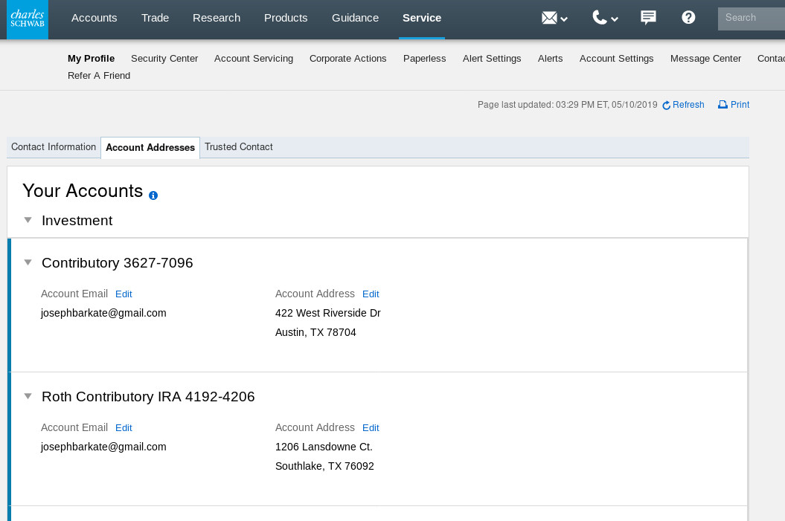

As an associate developer on the retail web technologies team at Charles Schwab Joseph worked on the Angular application development of the big-web customer facing [My Profile](https://client.schwab.com/Apps/service/myprofile/#/contactinformation) page.

Joseph developed in an Agile BDD environment involving two week sprints, daily standups and communication with project owners and usability testing with customers.  While working as a developer, Joe was tasked with assuming authority over and closing stories which included developing reusable components, directives, routes, services and unit tests in the Angular application. 

Several of Joseph’s components and directives were contributed back to Charles Schwab’s core reusable code base with included documentation to be used by other RWT teams.  In the Agile environment Joseph developed unit tests using the framework Jasmin and Karma to accomplish a 90% unit test code coverage.  Joseph has also exhibited leadership and presentation skills through leading several standups and retrospective, grooming and planning sessions. Mr. Barkate met and exceeded the expectations of his product manager by pushing to pre-production and production environments on schedule to deliver the software product requirements encompassed in the original contract. 

## Accomplishments and Responsbilities
* Developed important core security service and directives for financial safety in an Angular application.
* Led daily stand-ups and retrospective, grooming and planning sessions in an agile environment.
* Contributed to Charles Schwab core re-usable code base.
* Developed an efficient code base that could handle performance testing of over 100,000 users.

## Project Technologies/ Products
* Angular 2 & 4
* Typescript / Javascript
* CSS / HTML
* Jasmine / Karma
* Ruby
* Genkins
