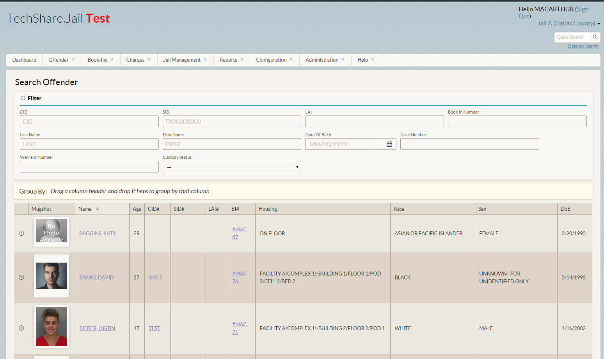

The Conference of Urban Counties (CUC) was tasked with developing a software solution for Jail facilities across the state of Texas. With a responsive web application as the agreed solution, Joseph worked as a full-stack developer utilizing Angular 5 and .NET core to to build experiences and components that facilitated end-to-end capabilities for the Texas Counties.  

## Front End Developement.

To create a user friendly web design Joseph worked closely with the UX team to weigh the advantages of different libraries in order create a design guide from scratch. Angular's Material theme was eventually chosen to be the applications approach to building components, themes and pallets. Utilizing the Material theme Joseph contributed to a shared library of components extended the Material components by including compatibility with client specific directives and pipes, as well as added unit tests.

## Back End Framework.

For the back end of the application .NET Core was utilized for a natively cross-platform with open source support.

Joseph worked closely with developers to wire up service calls to Angular's UI in an efficient and reusable manner. Due to the nature of the project the web application need the capability to search a potentially large database of entries. Elasticsearch was used as a RESTful search and analytic engine that would return results quickly in real time.

## Leadership and Maintaining High Quality Standards.

Apart from the core development team at CuC headquarters, Joseph worked very closely with multiple offshore teams in different time zones to deliver stories and sprints in a timely manner. Joseph provided thought leadership on best coding practices for reusable components and documentation as well as provided reviews for numerous offshore Pull Requests. Joseph also worked with SDETs to define story requirements and to aid in the use of automation testing through unique identifiers in HTML code. Through this Joseph created build steps in octopus deploy to run regression end-to-end tests every check in as well as every PR to prevent code check in from breaking the build.

## Accomplishments and Responsbilities
* Utilized Angular 5 framework to develop a web application for a Jail software system. 
* Managed multiple off-shore teams through daily meetings, pull requests and code reviews.
* Implemented back end HTTP request handling.
* Agile team environment with 2-week sprints. 
* Deconstructed requirements and designs into multiple reusable components managed in a shared library throughout the web application.
* Presented new application feature and functionality on a sprint-by-sprint basis to client.
* Completed a week long AWS certification course in Ohio heavily utilization for EC2.

## Project Technologies / Products
* Angular 5
* Typescript / Javascript
* CSS / HTML
* .NET Core
* C#
* Github / SonarQube
* Octopus Deploy / Teamcity
* Service Fabric
* ElasticSearch
* Protractor