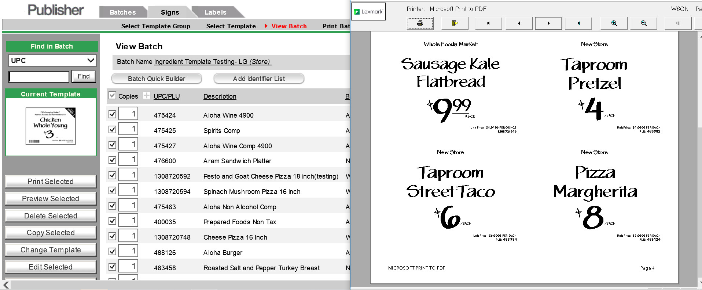

Development work on Whole Food's sign publishing application which allows quick pricing changes for markets across the United States to keep a competitive price point for every region.

### Production push and polish of new automated sign creation application.

For Whole Food's last push to production in a live environment Joseph was pulled on to develop and diagnose potential problems and bug with Whole Food's new product signage application. Using .NET on the back-end with a Lexmark design template for printing Joseph was required to account for the many different characteristics attributed to food products. (Non-GMO, Air-Chilled, Whole Trade, Animal Welfare, price/lb)

Due to wide variety of sign sizing and products Whole Foods offered the sprint schedule involved a very fast fast continuous integration and regression testing to deliver a fully polished product with the time constraints. This involved coordinating tasks in an Agile environment with project owners, developers and testings which required Joseph to wear multiple hats depending on where the bottleneck existed.

## Accomplishments and Responsbilities
* Quickly integrated with development team to contribute a delivered product in under 3 months.
* Worked multidisciplinary to prevent bottlenecks in a fast paced CICD enviroment.
* Oversaw product releases and provided release support at varied hours.

## Project Technologies / Products
* .NET 4
* C#
* Lexmark Template Designer
