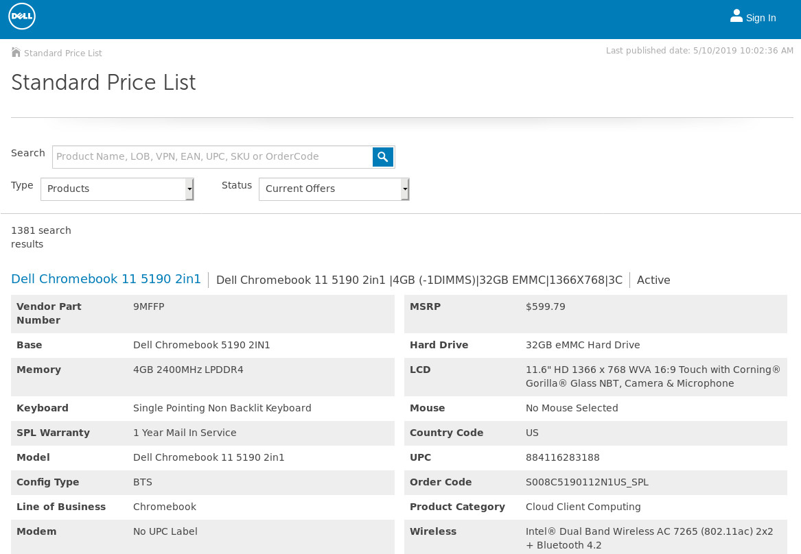
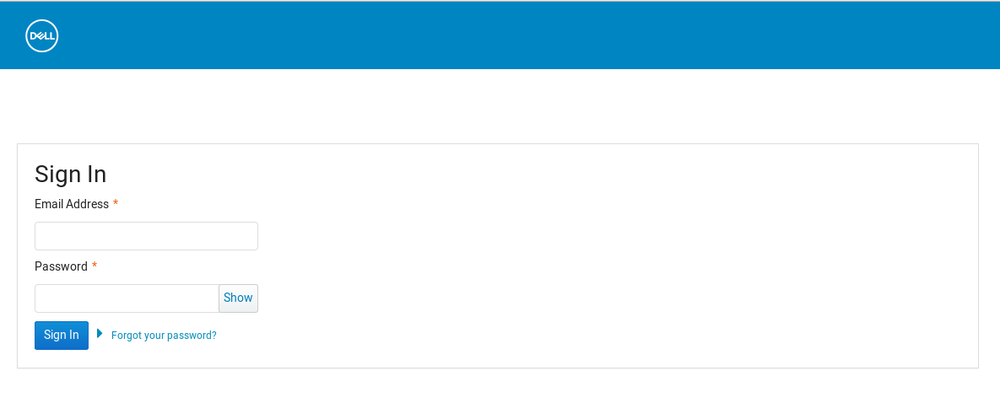

As a senior developer on the origin team of Dell’s standard price list application Joseph worked on a client facing application commonly used to sell to large Dell distributers.  While working there he used Angular with TypeScript for frond-end and .NET core for back-end work. He wrote APIs to communicate with both the MongoDB and SQL databases and wrote processors to consume multiple Dell services with RabbitMQ and NSB.  


### Experiance with older technologies and migration into new frameworks.

Joseph also contributed to the development team’s migration to Pivotal Cloud Foundry from Octopus deploy. While on the team Joseph rewrote/refactored javascript into typescript for the essentail rewrite from an outdate AngularJs to Angular 7.  Throughtout the sprints and refactoring Joseph worked closely with project owners to understand buisness requirements in order to write efficient readibly unit tests for both .Net and AngularJS/7 components.  This coordination similarly took place with SDET to define stories definition of done and to write end to end regression tests. By working on an Agile team Joseph voulenteered to write end to end tests using selenium when SDETs were swamped with regression tests usually near releases.


```javascript
import { Bootstrap } from "~bootstrap/scss/bootstrap";
import { Translate } from "translate";
import colors from "./colors";
```

For user interface deisgns Joseph worked alongside Dell's UX team to create responsive components using custom in house components, themes, and colors.  Being a global facing application, multiple countries/regions with multiple languages required translation for product information and descriptions using translation services. 

### Team player with Agile mindset.

Dell's Standard Price List team employed a conitnuous integration and continuous deployment pipeline bi-sprintly.  This translate to deployements into production every month.  While Dell's Price List is a Global clientfacing application, the number one region of buisness for the application was North America meaning pushes to prodcution always occured off standard work hours.  For release readiness Joseph was required to provide support off hours and volenteered for off hour health checks of databases and messaging systems.



Seen above is another area Joseph worked on, user authentication.  Different customers from different regions have preferences set for how their preference on how they want to view the price list.  The preferences includes language, currency and product history.
