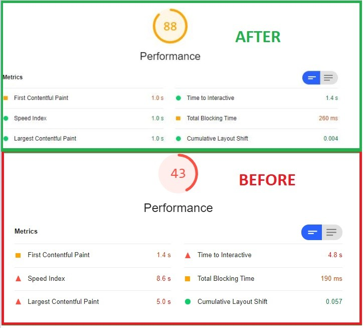

Full-stack Software Developer facilitating the formation of an international content management system for GM dealerships. Design of both front and back-end features intended to enhance and accelerate clients' ability to generate sales leads, capture customer analytics, edit themes, and amplify social media presence through elegant, yet effortless UI. Leadership and development of logging and data aggregation for big data infographics. Aptitude in performance testing optimization permitting reliable, scalable, and efficient applications hosted on PCF instances. Assurance of successful deployments in to live production environments through CICD Agile patterns.

Example website above can be found at: https://www.cotacchevrolet.com.br/

One of over 1000 websites created and managed on South American General Motors dealersites team.  Application primary focus was to act as a content managment system for dealerships in South America to easily allow customization and funcationality for quick online dealership presence.  Primary focus to generate leads and sales through GMs online division to continue growth in the South American market.

Above is a comparison of a before and after lighthouse score from browser rendering to server-side rendering utilizing Angular Universal.  One of the main accomplishments as a senior full-stack developer was the entire migration of the monolith Angular application to use express to render html on a cloud server and send to end user.  This architectural change was even more impactful considering most South American visitors use mobile devices with slower connection speeds.

Not only did this drastically improve performance as seen above but this allowed Google's search bots to correctly crawl the index file of all 1000+ unique dealer sites by allowing JavaScript to render the SEO tags before being crawled.  This led to higher search index scores which lead to a drastic increase in site traffic and leads created for all South American dealerships, and increasing leads generated by two fold.

## Accomplishments and Responsbilities

*	Led logging infrastructure and data aggregation for over 2+ Million daily messages to proactively resolve bugs prior to user detection.
*	Led performance team’s load and endurance tests to optimize application efficiency / scalability for 100,000+ users in peak performance hours.
*	Spearheaded sprint ceremonies and communication with project owners to define technical requirements.
*	Assisted in new hire onboarding and the mentorship of Jr Developers through code reviews and paired programming.
*	Production / release support for over 900 dealer web application across globe.

## Project Technologies / Products
* Angular 13
* React
* Express / Node.js
* Redis
* AngularJS
* .NET 4 / .NET Core
* SQL / Postgres
* C#
* Typescript / Javascript
* HTML / CSS / SCSS
* Pivotal Cloud Foundary
* Github / Gitlab / SonorQube